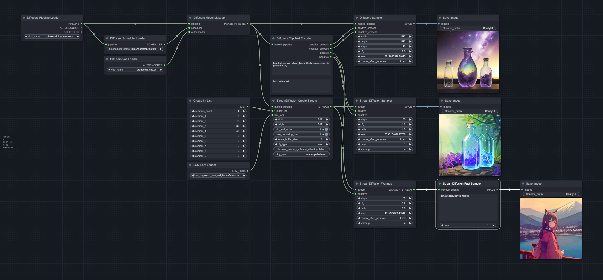
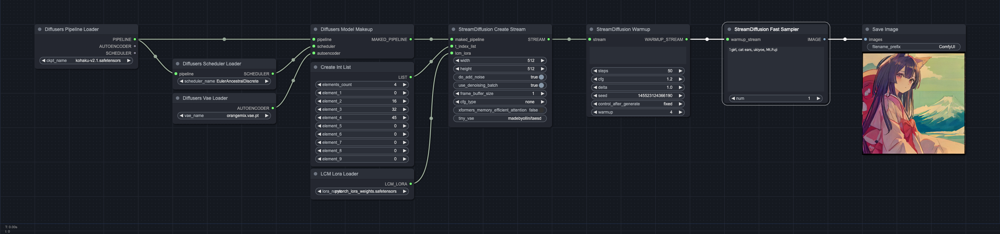

# ComfyUI-Diffusers

This repository is a custom node in ComfyUI.

## Overview

### Workflow 1

This is a program that allows you to use Hugging Face Diffusers module with ComfyUI. Additionally, Stream Diffusion is also available.



### Workflow 2

In addition, real-time generation is possible by doing the following.
When running, please enable Auto Queue in Extra options.



### Workflow 3

In combination with [VideoHelperSuite](https://github.com/Kosinkadink/ComfyUI-VideoHelperSuite.git), you can also run vid2vid.


The execution looks like this:


## Usage

Run the following command inside ComfyUI/custom_nodes.

```cmd
git clone --recurse-submodules https://github.com/Limitex/ComfyUI-Diffusers.git
cd ComfyUI-Diffusers
./install.sh
```

## Recommended Custom Nodes

https://github.com/Kosinkadink/ComfyUI-VideoHelperSuite.git

## Node

### Diffusers Pipeline Loader (DiffusersPipelineLoader)

### Diffusers Vae Loader (DiffusersVaeLoader)

### Diffusers Scheduler Loader (DiffusersSchedulerLoader)

### Diffusers Model Makeup (DiffusersModelMakeup)

### Diffusers Clip Text Encode (DiffusersClipTextEncode)

### Diffusers Sampler (DiffusersSampler)

### Create Int List (CreateIntListNode)

### LcmLoraLoader (LcmLoraLoader)

### StreamDiffusion Create Stream (StreamDiffusionCreateStream)

### StreamDiffusion Sampler (StreamDiffusionSampler)

### StreamDiffusion Warmup (StreamDiffusionWarmup)

### StreamDiffusion Fast Sampler (StreamDiffusionFastSampler)

## Reference

https://github.com/cumulo-autumn/StreamDiffusion
